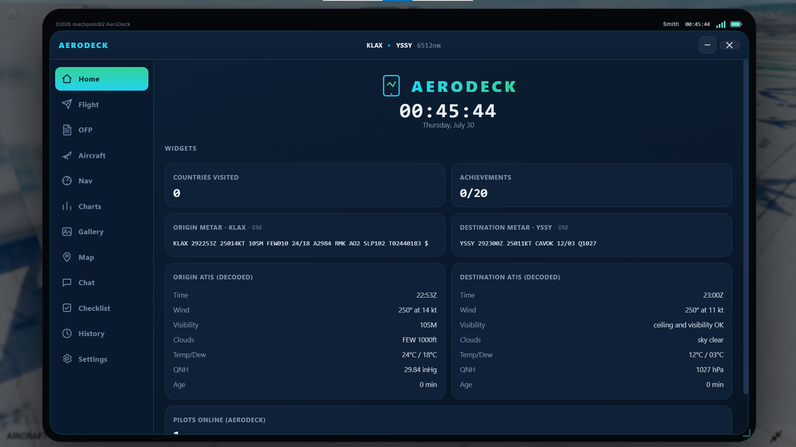
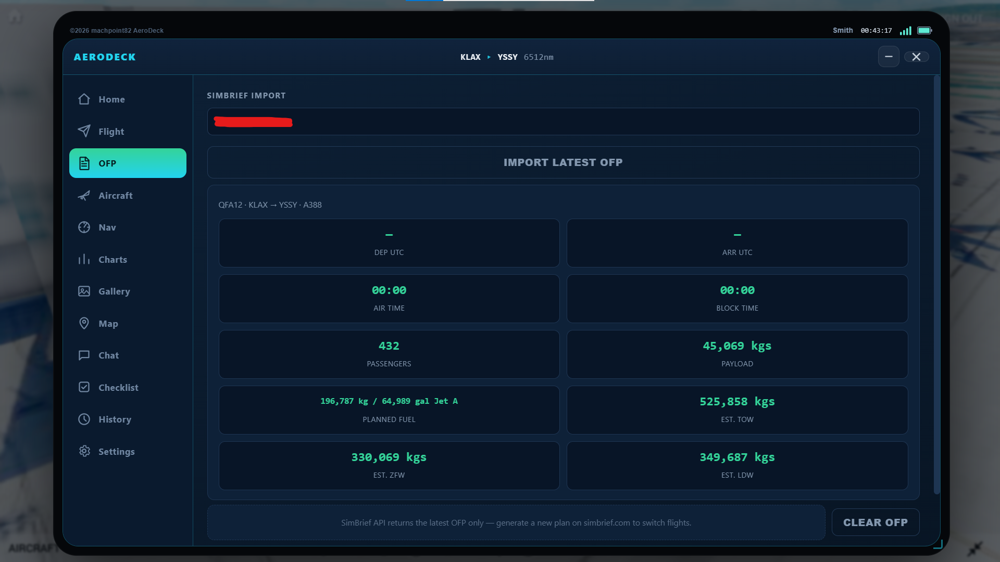
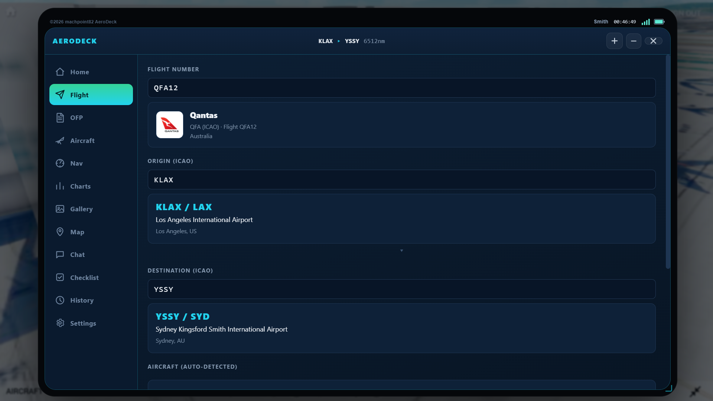
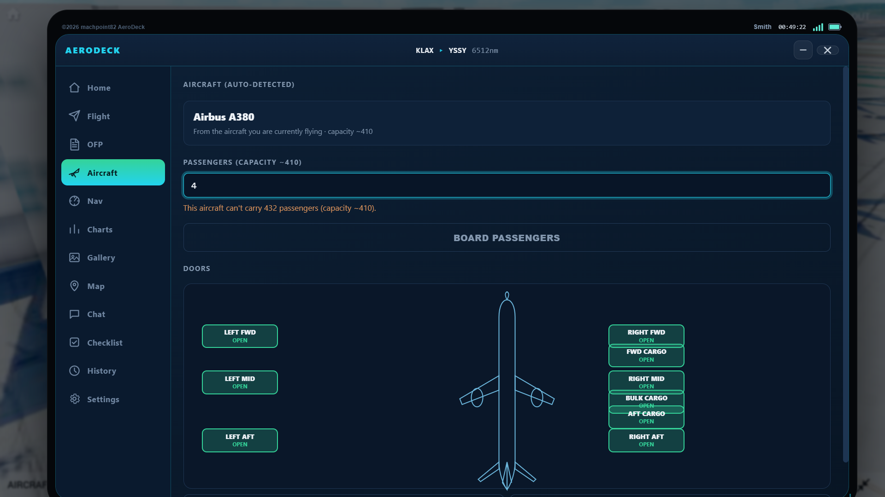
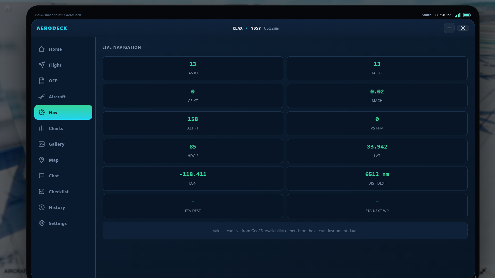
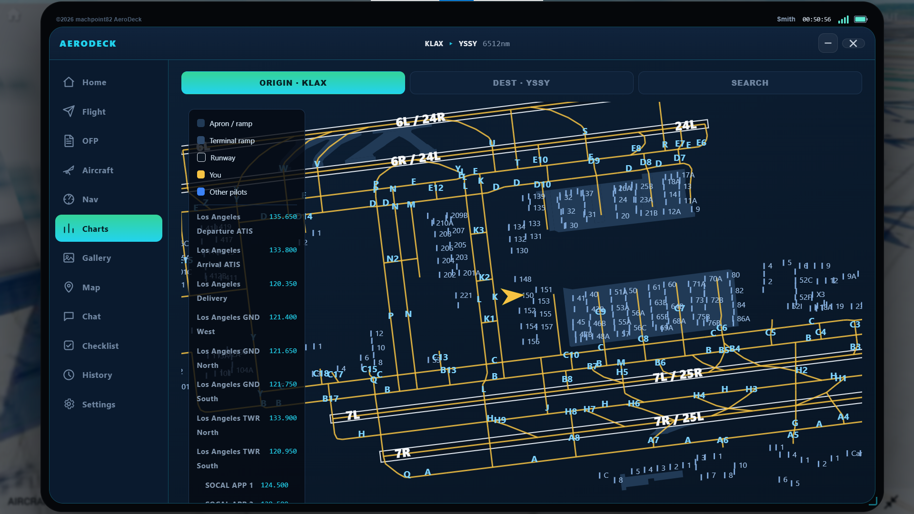
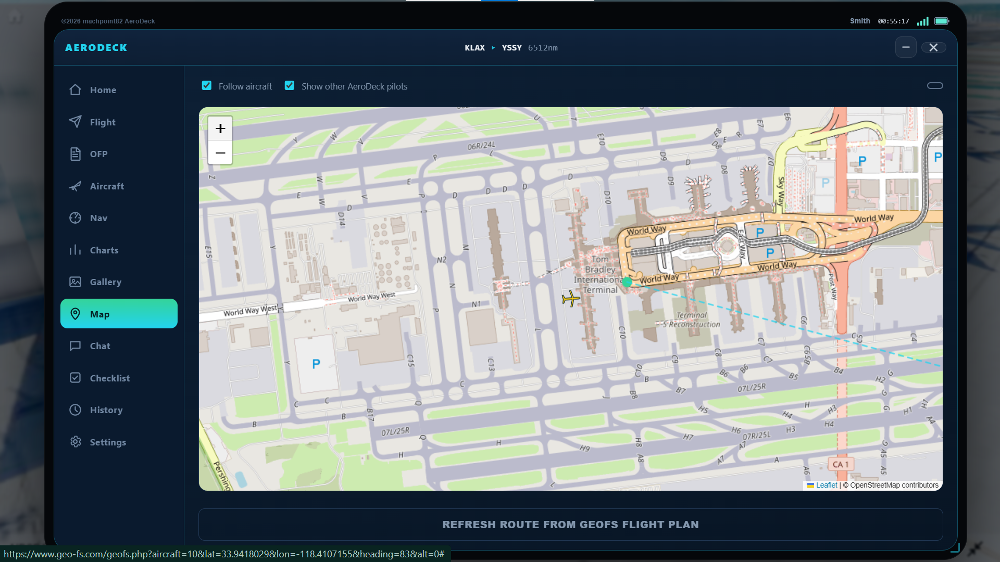
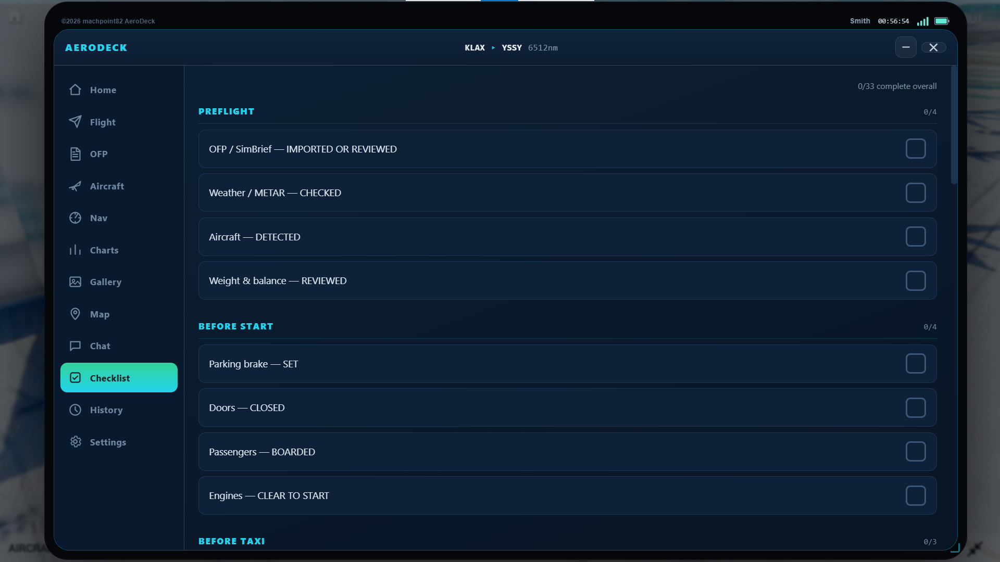
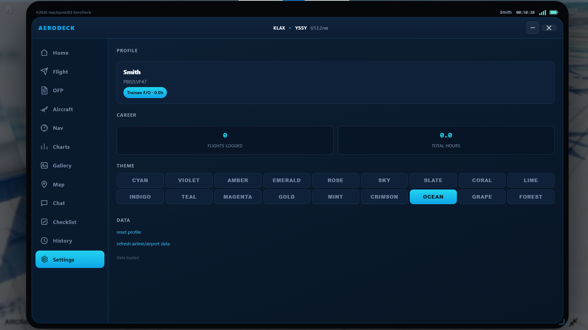
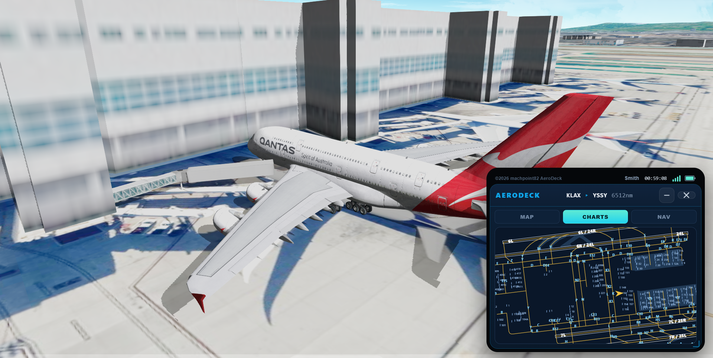

# AeroDeck EFB

<p align="center">
  
</p>

**A tablet-style Electronic Flight Bag for [GeoFS](https://www.geo-fs.com/), built as a Tampermonkey userscript.**

AeroDeck turns a GeoFS flight into something closer to a real commercial operation — pilot registration and career progression, automatic airline/airport/aircraft detection, real weather, live airport diagrams, a live moving map, other-pilot tracking and chat, a full pre-flight checklist, and SimBrief integration for real passenger/cargo/fuel numbers instead of guesses.

[](https://github.com/machpoint82/geofs-aero-deck)
[](https://www.geo-fs.com/)
[](https://www.tampermonkey.net/)
[](LICENSE)

> **Status:** v1.0.0 testing build. Features and tab layout are still evolving.

**Repository:** [github.com/machpoint82/geofs-aero-deck](https://github.com/machpoint82/geofs-aero-deck)

---

## Table of Contents

- [Installation](#installation)
- [Features by tab](#features-by-tab)
  - [Home](#home)
  - [Flight](#flight)
  - [OFP](#ofp)
  - [Aircraft](#aircraft)
  - [Nav](#nav)
  - [Charts](#charts)
  - [Gallery](#gallery)
  - [Map](#map)
  - [Chat](#chat)
  - [Checklist](#checklist)
  - [History](#history)
  - [Settings](#settings)
- [The tablet itself](#the-tablet-itself)
- [Requests & issues](#requests--issues)
- [Multiplayer & chat backend (optional)](#multiplayer--chat-backend-optional)
- [Repository structure](#repository-structure)
- [Performance notes](#performance-notes)
- [Credits](#credits)

---

## Installation

1. Install [Tampermonkey](https://www.tampermonkey.net/) (or a compatible userscript manager).
2. Install the AeroDeck script from this repo — open the [raw userscript](https://raw.githubusercontent.com/machpoint82/geofs-aero-deck/main/aerodeck-efb.js) and Tampermonkey will pick it up, or use a release asset if published.
3. Open [GeoFS](https://www.geo-fs.com/). An **EFB** control appears with the other GeoFS UI buttons.
4. Open the tablet. First launch asks for a pilot name. Your **Pilot ID** is generated once and ties to your logbook and career stats.

**Compatible with GeoFS 3.9 and 4.0** (browser). Requires Tampermonkey grants for storage and cross-origin weather/SimBrief fetches.

---

## Features by tab

### Home

- Live clock (with seconds) and date
- Career widgets: countries visited, achievements (20 milestones)
- Origin / destination **METAR** (auto-refresh) and **decoded ATIS**
- **Pilots online (AeroDeck)** — count of pilots broadcasting AeroDeck presence (not the whole GeoFS multiplayer list)

<p align="center">
  
</p>
<p align="center"><em>Home — clock, career widgets, METAR / decoded ATIS, AeroDeck pilots online</em></p>

### Flight

- Type a flight number (e.g. `QFA12`) — airline is resolved from IATA/ICAO
- Origin / destination ICAO — name, city, country looked up from the airport database
- **Aircraft auto-detected** from the GeoFS aircraft you spawned
- **SimBrief import** (from the OFP tab) autofills flight number, origin, and destination
- **Start Flight** / **End Flight** gated by realistic conditions (ground, doors, boarding, proximity to an airport for end)
- Live tracking while active: phase, time in air, distance remaining, ETA, speed, altitude
- Aircraft mismatch prompt if the OFP type does not match the plane you are flying

<p align="center">
  
</p>
<p align="center"><em>Flight — airline lookup, origin/destination, auto-detected aircraft</em></p>

### OFP

- **SimBrief import** — username → latest OFP via SimBrief public API (`json=v2`)
- Summary: passengers, payload, planned fuel (kg + Jet A gallons), TOW / ZFW / LDW, air/block times when present
- **Clear OFP** to drop the imported plan
- Boarding is handled on the **Aircraft** tab (pax target is pre-filled from the OFP when available)

<p align="center">
  
</p>
<p align="center"><em>OFP — SimBrief import with weights, times, and planned fuel</em></p>

### Aircraft

- Auto-detected aircraft name and capacity estimate
- **Passenger boarding** with timed progress (scaled to count) and **Deplane**
- **Door diagram** — top-down silhouette with per-door OPEN/CLOSED toggles (layout scales with capacity: narrowbody vs widebody / cargo)

<p align="center">
  
</p>
<p align="center"><em>Aircraft — passenger boarding and interactive door diagram</em></p>

### Nav

- Live IAS, TAS, GS, Mach, altitude, vertical speed, heading, lat/lon
- Distance and ETA to destination (and next waypoint when GeoFS exposes one)

<p align="center">
  
</p>
<p align="center"><em>Nav — live IAS, TAS, GS, altitude, heading, distance & ETA</em></p>

### Charts

- Airport diagrams (apron, taxiways, runways, gates, COM frequencies)
- Origin / destination / search modes
- Your aircraft (yellow) and other AeroDeck pilots (blue) on the diagram
- Coverage grows over time — see [Requests & issues](#requests--issues) to ask for an airport

<p align="center">
  
</p>
<p align="center"><em>Charts — airport diagram, frequencies, live aircraft icon</em></p>

### Gallery

- Placeholder for a low-res image index from the repo (optional, non-blocking)

### Map

- Leaflet + OpenStreetMap tiles
- Follow aircraft, route from GeoFS flight plan (or origin→dest line)
- **AeroDeck-only** multiplayer markers (opt-in)

<p align="center">
  
</p>
<p align="center"><em>Map — Leaflet / OpenStreetMap with follow-aircraft and route</em></p>

### Chat

- Optional text chat with other AeroDeck pilots
- Age acknowledgment (13+) on first use

### Checklist

- Airline-style phases: Preflight → Shutdown
- Items cover OFP review, weather, doors, boarding, and standard flow

<p align="center">
  
</p>
<p align="center"><em>Checklist — airline-style phases from preflight through shutdown</em></p>

### History

- Logbook of completed flights (airline, route, aircraft, times, distance, pax)

### Settings

- Profile and career stats
- **18 accent themes** (two rows of nine)
- Reset profile and refresh airline/airport data (with confirmation)

<p align="center">
  
</p>
<p align="center"><em>Settings — profile, career stats, 18 accent themes</em></p>

---

## The tablet itself

- Draggable and **freely resizable** (size/position remembered)
- **Minimize** to a compact Map / Charts / **Nav** view
- Status strip: credits, username, local time, signal & battery-style icons
- Does not steal GeoFS keyboard focus when typing in fields

<p align="center">
  
</p>
<p align="center"><em>Minimized mode — Map / Charts / Nav at a glance while flying</em></p>

---

## Requests & issues

Use GitHub Issues so requests stay searchable and don’t get lost in chat.

| Type | Use when | Open |
|------|----------|------|
| **Airport chart request** | You need a diagram for an ICAO that isn’t in `charts/` yet | [New chart request](https://github.com/machpoint82/geofs-aero-deck/issues/new?template=airport-chart-request.md) |
| **Feature request** | Idea for the tablet, tabs, SimBrief, multiplayer, etc. | [New feature request](https://github.com/machpoint82/geofs-aero-deck/issues/new?template=feature-request.md) |
| **Bug report** | Something broken in GeoFS with AeroDeck | [New issue](https://github.com/machpoint82/geofs-aero-deck/issues/new) |

Before opening a chart request, check whether `charts/YOURICAO.json` already exists and whether someone already filed the same ICAO.

Templates live in `.github/ISSUE_TEMPLATE/` once you push that folder.

---

## Multiplayer & chat backend (optional)

AeroDeck can share presence and chat over a small private backend so only **AeroDeck users** appear on the map/charts and in chat — not every GeoFS multiplayer client. If the backend URL is not configured, those features simply stay offline; the rest of the EFB works normally.

---

## Repository structure

```
geofs-aero-deck/
├── .github/
│   └── ISSUE_TEMPLATE/
│       ├── airport-chart-request.md
│       └── feature-request.md
├── charts/                 # One JSON diagram per airport (e.g. KLAX.json)
├── data/
│   ├── airports.js         # Airport reference data (@require)
│   └── airlines.js         # Airline reference data (@require)
├── preview/                # README screenshots + app icon
│   ├── icon.png
│   ├── home.png
│   ├── flight.png
│   ├── ofp.png
│   ├── aircraft.png
│   ├── nav.png
│   ├── charts.png
│   ├── map.png
│   ├── checklist.png
│   ├── settings.png
│   └── minimized.png
├── aerodeck-efb.js         # Main Tampermonkey userscript
└── README.md
```

---

## Performance notes

- Airline/airport datasets load via `@require` / cached fetch so lookups stay off the GeoFS frame loop
- UI renders are coalesced with `requestAnimationFrame` to avoid scroll fighting
- METAR is cached and refreshed on an interval so long flights do not keep a stale observation forever
- Chart JSON is loaded on demand per ICAO

---

## Credits

Built by **[machpoint82](https://github.com/machpoint82)**

- Airline/airport reference data derived from [OpenFlights](https://openflights.org/) and [mwgg/Airports](https://github.com/mwgg/Airports)
- Weather from [aviationweather.gov](https://aviationweather.gov/) and [VATSIM](https://metar.vatsim.net/)
- Flight planning data via [SimBrief](https://www.simbrief.com/)
- Map tiles © [OpenStreetMap](https://www.openstreetmap.org/) contributors, rendered with [Leaflet](https://leafletjs.com/)

### Related projects

- Fuel-system ideas and GeoFS instrumentation patterns inspired by **Experimental Flight Interface (EFI)** by [Ferhatduran55](https://github.com/Ferhatduran55) — [geofs-experimental-fi](https://github.com/Ferhatduran55/geofs-experimental-fi).

---

© 2026 machpoint82 · AeroDeck
